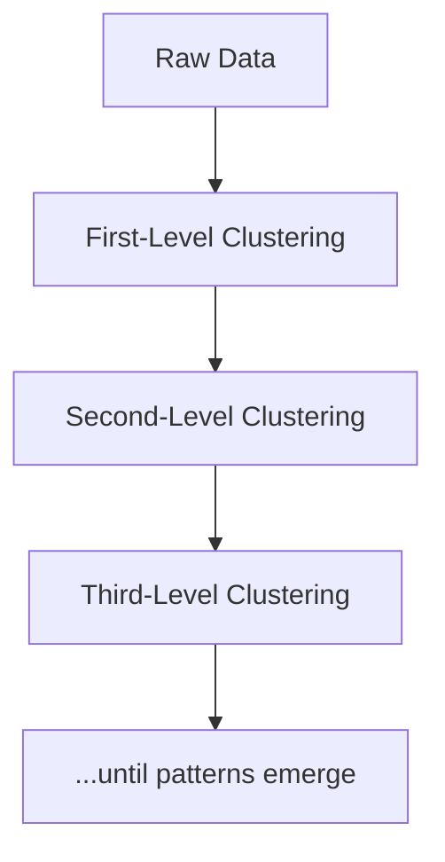

# 🧠✨ **Instinct AI** – Let Your Data Speak for Itself

Welcome to **Instinct AI**, the fearless analytics platform that follows its gut – recursively.
We don’t just analyze your data… we **hunt insights** through **recursive clustering**, revealing patterns that basic analytics wouldn't dare to chase.

---

## 🔍 What is Instinct AI?

> “When instincts and algorithms collide, intelligence is born.”

**Instinct AI** is your data’s sixth sense.
It explores, clusters, and digs deeper – layer after layer – to uncover the **true structure** of your data.

Think of it as a data detective with recursion on overdrive.

---

## 🔥 Key Features

* 🌀 **Recursive Clustering Engine** – Because one layer is never enough.
* 📊 **Interactive Cluster Explorer** – Visualize how your data breaks down across multiple levels.
* 🧭 **Breadcrumb Navigation** – Follow the trail of your analytical instincts.
* 🎯 **Customizable Inputs** – Select columns, set depths, and tune granularity.
* 🚀 **One-Click Upload** – Drop your dataset in and let Instinct do the thinking.
* 🧠 **API-Ready** – Integrate recursive brilliance into your own apps.

---

## ⚙️ How It Works

1. **Upload** your data
2. **Select** the features to analyze
3. **Recursively cluster** the data
4. **Explore** the hierarchy
5. **Act** on deep, meaningful insights

---

## 🧠 Use Cases

* 🛍️ Discover micro-segments in customer behavior
* 📉 Uncover hidden trends in financial datasets
* 🧬 Dive into gene/protein expression hierarchies
* 🛰️ Detect anomalies in sensor or satellite data
* 📚 Map out learning patterns in student performance

If it’s data, Instinct AI finds the instinct behind it.

---

## 🧰 Built With

* 🐍 Python
* ⚡ FastAPI
* 📊 Streamlit + Plotly
* 🧮 Scikit-learn, pandas
* 🧠 MongoDB (for recursive memory)

---

> *"Instinct is intelligence with speed."*
> – Someone who probably loved recursive clustering
